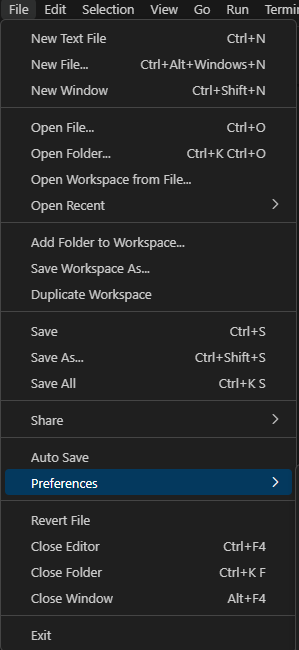
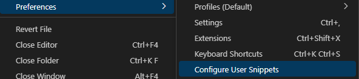
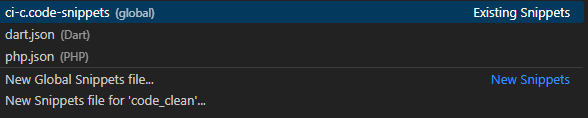

# CodeIgniter 4 Application Starter

## What is CodeIgniter?

CodeIgniter is a PHP full-stack web framework that is light, fast, flexible, and secure.
More information can be found at the [official site](http://codeigniter.com).

This repository holds a composer-installable app starter.
It has been built from the
[development repository](https://github.com/codeigniter4/CodeIgniter4).

# Estructura MVC (Modelo, Vista, Controlador)

En el directorio raíz del proyecto se encuentran los archivos de configuración y controladores:

1. **app** - Directorio donde se almacenan todos los componentes de la aplicación.
2. **public** - Es el directorio público que contiene todo lo que es visible para el usuario final.
   Dentro de **app** se dividen en tres partes:
3. **Controllers** - Aquí se guardarán las clases de controlador.
4. **Models** - Aquí se guardarán las clases de Modelo.
5. **Views** - Aquí se guardarán las vistas o plantillas HTML.

- Dentro de **Views** se debe mantener la siguiente estructura: **Views/carpeta/archivos.php**
- Carpetas: Se crean carpetas según sea necesario el catalogo a trabajar.
- Archivos: Cada vista tiene un nombre único correspondiente a una función del controlador.
- Dentro de **Models** - se debe mantener la siguiente estructura: **Models/archivo.php**
- Archivo: El nombre del archivo corresponde con el nombre de la tabla a consultar.
- Dentro de **Controllers** - se dene mantener la siguiente estructura: **Controllers/archivo.php**
- Archivo: El nombre del archivo corresponde con el nombre del controlador.

## Configuración de Visual Studio Code (VSCode)

# Crear Snnipets de Visual Studio Code (VSCode)

1. 
2. 
3. 

- Crar nuevo snnipet si aun no cuenta con algun archivo de snnipet, de tener uno solo agregar el siguiente codigo:

## Codigo del Snnipet para CI4

```json
{
  "Crear_controlador": {
    "prefix": "cicontroller",
    "body": [
      "<?php",
      "",
      "namespace App\\Controllers;",
      "//Libreries",
      "use App\\Libraries\\Class_seguridad;",
      "//Modelos",
      "use App\\Models\\Model_global;",
      "use App\\Models\\Model_selectores;",
      "# Es el modelo del catalago a usar.",
      "# Cambiar nombre Model_catalogo por un modelo real.",
      "use App\\Models\\Model_catalago;",
      "",
      "class $NombreDelControlador extends BaseController {",
      "    var $$seguridad;",
      " var $$mdl_global;",
      "    var $$mdl_select;",
      "    var $$mdl_catalogo;",
      "    ",
      "    public function __construct()",
      "    {",
      "        $$this->seguridad = new Class_seguridad();",
      "        $$this->mdl_global = new Model_global();",
      "        $$this->mdl_select = new Model_selectores();",
      "        $$this->mdl_catalogo = new Model_catalago();",
      "        session_start();",
      "    }",
      "",
      "    public function index()",
      "    {",
      "        if (isset($$$_SESSION['iduser19'])) {",
      " $$$tipoacceso = $$$this->seguridad->check_permission($$$_SESSION['iduser19'], $$$this->seguridad->key_access('PERMISO'));",
      " if ($$$tipoacceso >= 1) {",
      "                $$$data['tipoacceso'] = $$$tipoacceso;",
      "                echo view('carpeta/vista', $$$data);",
      " } else {",
      " echo view('errors/html/sin_acceso');",
      " }",
      " } else $$$this->seguridad->login_back();",
      " }",
      "}",
      ""
    ],
    "description": "Crear controlador"
  },

  "Crear base de modelo bd": {
    "prefix": "cimodel",
    "body": [
      "<?php",
      "",
      "namespace App\\Models;",
      "",
      "use CodeIgniter\\Model;",
      "",
      "class $name extends Model {",
      " var $$database;",
      " public function __construct() {",
      " $$database = \\Config\\Database::connect('default');",
      " $$this->database = $$database;",
      " }",
      "",
      " public function getlistJSON(string $$columnPK = null, array $$conditions) {",
      " $$builder = $$this->database->table('nombre_tabla');",
      " $$builder->select('*');",
      " //$$builder->join('tabla_a_unir', 'condicion_a_cumplir', 'left');",
      " if ($$columnPK != null) {",
      " $$builder->where($$conditions);",
      " }",
      " //$$builder->orderBy('columna_a_ordenar', 'valor_de_orden');",
      " $$query = $$builder->get();",
      " return $$query ? $$query->getResult() : false;",
      " }",
      "}",
      ""
    ],
    "description": "Crear Modelo"
  }
}
```

#
